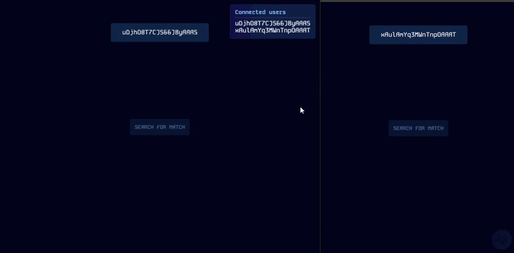

#  Versus


> A platform for developing multiplayer games

## Installation
### Front-end
```sh
$ git clone https://github.com/TacioAntonio/versus
$ cd versus/frontend
$ npm i
```

### Back-end
```sh
$ git clone https://github.com/TacioAntonio/versus
$ cd versus/backend
$ npm i
```

## Running locally
```sh
$ npm start
```

## Contribution
Please read [CONTRIBUTING.md](https://github.com/TacioAntonio/versus/blob/master/CONTRIBUTING.md) for details on our code of conduct, and the process for submitting pull requests to us.

## Versioning
We use [SemVer](http://semver.org/) for versioning. For the versions available, see the [tags on this repository](https://github.com/TacioAntonio/versus/tags).

## Authors
| 
| -
| [Tácio Antônio](https://github.com/TacioAntonio/)

See also the list of [contributors](https://github.com/TacioAntonio/versus/graphs/contributors) who participated in this project.

## License
This project is licensed under the MIT License - see the [LICENSE.md](https://github.com/TacioAntonio/versus/blob/master/LICENSE.md) file for details.

